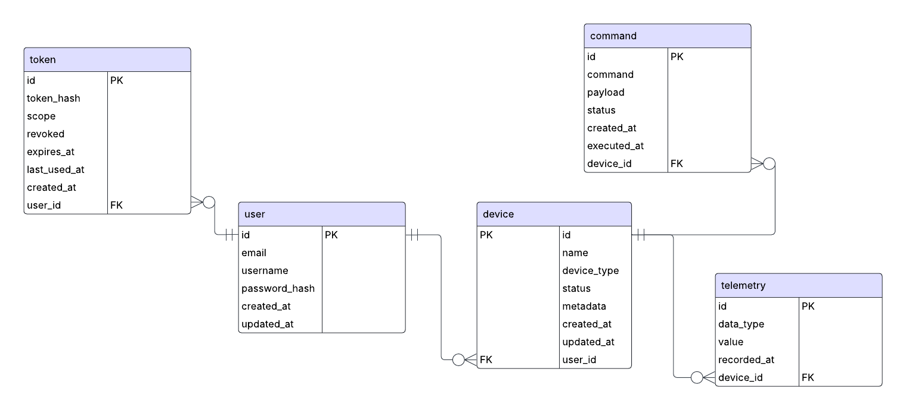

# Database Design

This document outlines the database structure for the **Device Telemetry API**, showing tables, column types, relationships, and example data.

## **1. Users Table**

Stores user accounts and authentication info.

| Column        | Type        | Notes                 |
| ------------- | ----------- | --------------------- |
| id            | UUID        | Primary Key           |
| username      | VARCHAR     | Unique                |
| email         | VARCHAR     | Unique                |
| password_hash | TEXT        | Hashed password       |
| created_at    | TIMESTAMPTZ | Account creation time |
| updated_at    | TIMESTAMPTZ | Last update time      |

**Example:**

```json
{
  "id": "uuid-1234",
  "username": "john_doe",
  "email": "john@example.com",
  "password_hash": "$2a$12$abc123hashedpassword",
  "created_at": "2025-08-14T12:00:00Z",
  "updated_at": "2025-08-14T12:00:00Z"
}
```

## **2. Devices Table**

Tracks user devices, type, status, and optional metadata.

| Column      | Type      | Notes                                 |
| ----------- | --------- | ------------------------------------- |
| id          | UUID      | Primary Key                           |
| user_id     | UUID      | Foreign Key → Users(id)               |
| name        | VARCHAR   | Device name                           |
| device_type | VARCHAR   | E.g., temperature_sensor              |
| status      | VARCHAR   | Online / Offline                      |
| metadata    | JSONB     | Flexible info like firmware, location |
| created_at  | TIMESTAMP | Device added time                     |
| updated_at  | TIMESTAMP | Last update time                      |

**Example:**

```json
{
  "id": "uuid-5678",
  "user_id": "uuid-1234",
  "name": "Living Room Sensor",
  "device_type": "temperature_sensor",
  "status": "Online",
  "metadata": {
    "manufacturer": "AcmeSensors",
    "firmware_version": "v1.2.3",
    "location": "Living Room"
  },
  "created_at": "2025-08-14T12:05:00Z",
  "updated_at": "2025-08-14T12:30:00Z"
}
```

## **3. Telemetry Table**

Stores sensor readings from devices. Flexible using JSONB.

| Column      | Type      | Notes                     |
| ----------- | --------- | ------------------------- |
| id          | UUID      | Primary Key               |
| device_id   | UUID      | Foreign Key → Devices(id) |
| data_type   | VARCHAR   | E.g., environment, motion |
| value       | JSONB     | Sensor readings, flexible |
| recorded_at | TIMESTAMP | Timestamp of reading      |

**Example:**

```json
{
  "id": "uuid-9012",
  "device_id": "uuid-5678",
  "data_type": "environment",
  "value": {
    "temperature": 24.5,
    "humidity": 48.2,
    "light": 300
  },
  "recorded_at": "2025-08-14T12:10:00Z"
}
```

## **4. Commands Table**

Stores commands issued to devices with flexible payloads.

| Column      | Type      | Notes                       |
| ----------- | --------- | --------------------------- |
| id          | UUID      | Primary Key                 |
| device_id   | UUID      | Foreign Key → Devices(id)   |
| command     | VARCHAR   | Command name                |
| payload     | JSONB     | Flexible command arguments  |
| status      | VARCHAR   | Pending / Executed / Failed |
| created_at  | TIMESTAMP | Command issued time         |
| executed_at | TIMESTAMP | When executed (nullable)    |

**Example:**

```json
{
  "id": "uuid-3456",
  "device_id": "uuid-5678",
  "command": "set_threshold",
  "payload": {
    "temperature": 25.0,
    "humidity": 50.0
  },
  "status": "Pending",
  "created_at": "2025-08-14T12:15:00Z",
  "executed_at": null
}
```

## **5. Tokens Table**

Stores authentication and verification tokens securely.

| Column       | Type        | Notes                                                      |
| ------------ | ----------- | ---------------------------------------------------------- |
| id           | UUID        | Primary Key                                                |
| token_hash   | BYTEA       | Hashed token (unique, never store plain tokens)            |
| user_id      | UUID        | Foreign Key → Users(id), cascade on delete                 |
| scope        | TEXT        | Token type: `auth`, `email_verification`, `password_reset` |
| revoked      | BOOLEAN     | Whether the token is revoked                               |
| expires_at   | TIMESTAMPTZ | Expiry timestamp                                           |
| last_used_at | TIMESTAMPTZ | When token was last used (nullable)                        |
| created_at   | TIMESTAMPTZ | Creation time                                              |

**Example:**

```json
{
  "id": "uuid-7890",
  "token_hash": "base64-hash==",
  "user_id": "uuid-1234",
  "scope": "auth",
  "revoked": false,
  "expires_at": "2025-08-15T12:00:00Z",
  "last_used_at": "2025-08-14T12:30:00Z",
  "created_at": "2025-08-14T12:00:00Z"
}
```

## **6. Relationships Overview**

- **Users** have many **Devices**.
- **Devices** have many **Telemetry entries**.
- **Devices** can receive many **Commands**.
- **Users** have many **Tokens**.


