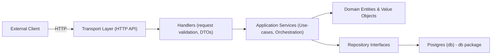

# API System Design

## Overview

The codebase is DDD-inspired (Domain-Driven Design) while pragmatic: it enforces a clear separation between domain logic and infrastructure concerns, keeps domain types and invariants explicit, and avoids excessive boilerplate. The design prioritizes testability, clarity, and maintainability, making it easy for another developer to read and reason about, while being practical for production.

## Key Points

- Single-binary Go service with minimal external dependencies
- Clear boundaries: domain, services (use-cases), repositories (infrastructure), and transport (HTTP).
- Strong domain modeling: entities, value objects, rehydration, and domain errors.
- Production-minded choices: cursor-based pagination, connection pooling via pgx, JWT auth, request timeouts.

## High-Level Architecture



## Project layout (summary)

```bash
cmd/api/main.go         # entrypoint: load config, connect DB, migrate, start server
internal/app            # dependency wiring (repositories -> services -> handlers -> router) and build router
internal/transport/http # HTTP handlers, router, request/response DTOs, middleware
internal/<domain>       # device, command, telemetry, token, user—domain models, services, errors
internal/db             # repositories and migrations
internal/config, logger # support utilities
```

## Domain Model

The **domain layer** defines the core **Entities, Value Objects, and Invariants** in `internal/<domain>` (e.g., `internal/command/command.go`). This layer encapsulates the business rules and domain logic, ensuring they are **reusable, consistent, and independent of infrastructure**.

Key principles:

- **Entities** represent objects with a persistent identity, such as `Command` or `Device`.
- **Value Objects** represent immutable concepts defined solely by their attributes, such as `Name`, `Status`, `ExecutedAt`, or `Payload`.
- **Invariants** enforce rules and constraints that must always hold, such as:

  - Command names must be 3–50 characters and match a specific regex.
  - Payloads must be non-empty JSON objects.
  - `ExecutedAt` timestamps cannot be in the future.

Domain objects provide **constructors and methods** to:

- Validate and enforce invariants at creation.
- Update their state in a controlled way (e.g., `UpdateStatus`, `UpdateExecutedAt`).
- Rehydrate from persistent storage safely, ensuring any corrupted data is detected and rejected.

## Application Services / Use-Cases

**Application Services** (or use-case services) orchestrate interactions between the **domain layer** and the **infrastructure layer** to perform domain operations. They are responsible for executing business use-cases without containing domain rules themselves.

Key responsibilities:

1. **Create and manipulate domain objects** using constructors and methods provided by the domain layer.
2. **Persist domain objects** or query data via repositories.
3. **Accept and return DTOs** at the transport layer boundary, while internal operations work directly with domain objects.

### Key Points

- Application Services **do not contain business rules**—those belong in the domain layer.
- They **orchestrate the steps** needed to complete a use-case: creation, persistence, and updating of domain objects.
- They **bridge DTOs from transport layers** to domain objects, ensuring the domain remains isolated and consistent.

## Transport Layer (HTTP handlers)

Here’s a polished and structured version of your **Transport Layer (HTTP Handlers)** section for `system-design.md` that’s clearer and consistent with your previous sections:

## Transport Layer (HTTP Handlers)

The **transport layer** is responsible for **translating external input (e.g., JSON requests) into domain-level value objects**, invoking application services, and returning results as JSON responses. Handlers also perform **request validation, error handling, and middleware integration**.

### Responsibilities

1. **Input validation:** Ensure incoming data conforms to required formats before creating domain objects.
2. **DTO mapping:** Convert JSON requests into domain value objects and domain objects into JSON responses.
3. **Orchestration:** Call application services to execute business use-cases.
4. **Error handling:** Return appropriate HTTP status codes and messages for client or server errors.
5. **Middleware integration:** Support authentication, logging, and metrics collection.

## Error handling

- Domain-specific errors are exposed (e.g., command.ErrCommandNotFound, device.ErrDeviceNotFound) and mapped to appropriate HTTP status codes in handlers

- DB constraint errors are inspected and translated (foreign key constraint → ErrDeviceNotFound).

## Design trade-offs and rationale

- Pragmatic DDD: explicit domain types and rehydration give strong invariants and fewer runtime surprises. Avoided heavy frameworks to keep codebase simple and easy for new contributors.
- Cursor-based pagination vs offset:
  - Pros: consistent, efficient, scales for large datasets.
  - Cons: cursor management complexity for clients (but encoded cursor string hides internals)
